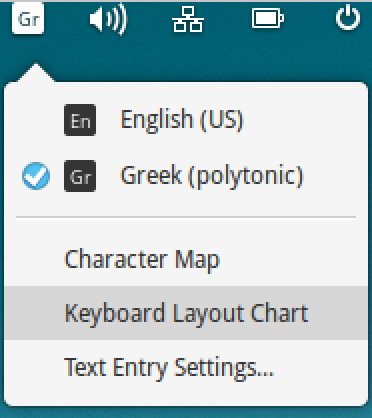
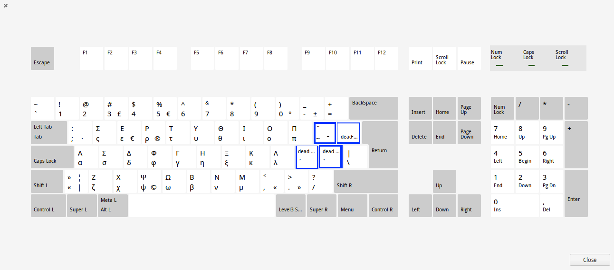

From the menu showing installed keyboard layouts, you can  pull up a chart illustrating the organization of the selected keyboard layout.

The four keys highlighted in blue below are "dead keys" for typing accents, breathings, iota subscript and diaeresis. Type the dead key *first*, then type a vowel the dead key should combine with.

The two keys immediately to the right of λ add the acute and grave accent marks; when typed with the shift key, they add the smooth and rough breathing marks.  To combine an accent and a breathing over a vowel, type the breathing and the accent (in either order), then type the vowel.

The key immediately to the right of π adds a circumflex accent; when typed with the shift key, it adds the diaeresis.  The second second key to the right of π adds the iota subscript.

The placement of other characters on the keyboard is indicated in the chart.  If you need to add characters that are not on your keyboard, you can copy and paste from this sheet of "[hard-to-type characters](http://homermultitext.github.io/hmt-docs/tips/pasteboard/)".

.
